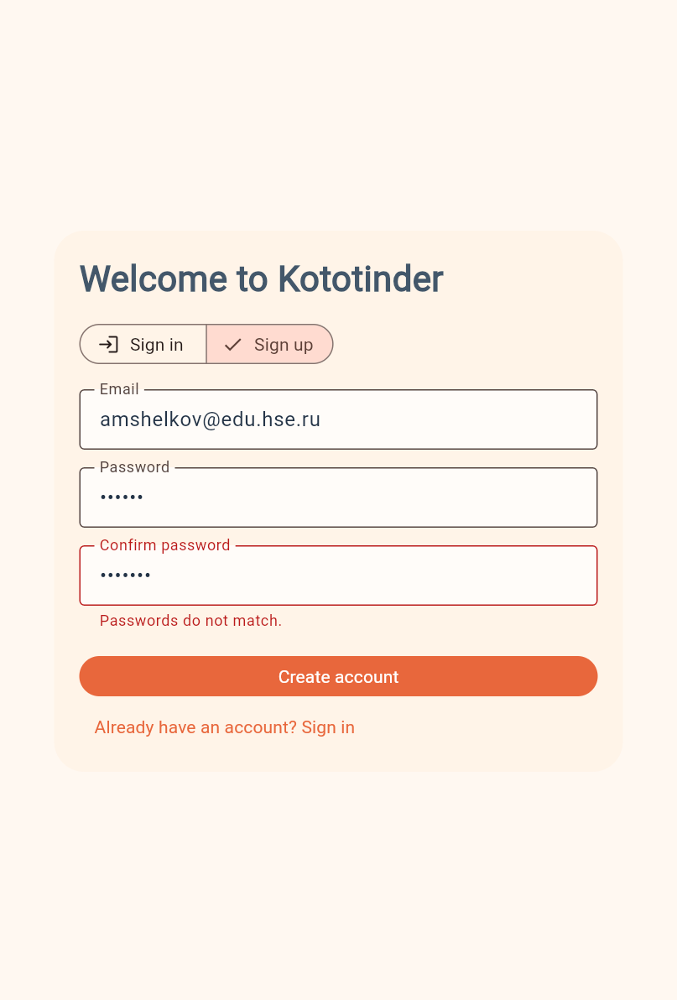
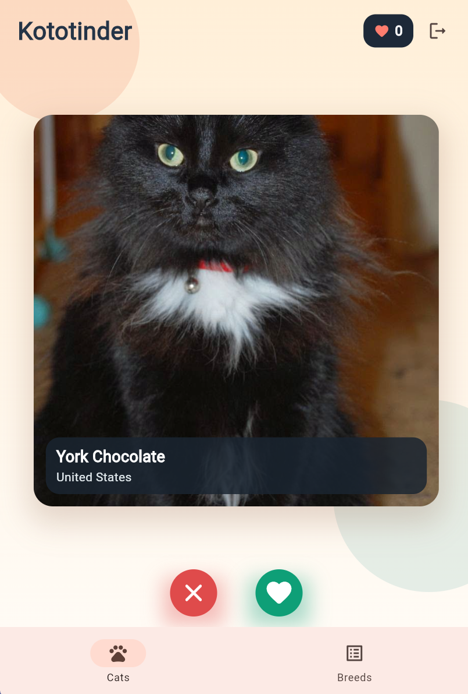

# Kototinder

### **ФИО:** *Шелков Андрей Михайлович*  
### **Группа:** *БПИ233*  

---

## Описание проекта

Приложение позволяет просматривать случайных котиков в формате свайп-карточек, а также просматривать список пород с детальной информацией.

---

##  Реализованный функционал

- Механика свайпов влево и вправо для оценки котиков.  
- Подсчёт количества лайков.  
- Открытие подробной информации о породе при нажатии на карточку кота.  
- Экран со **списком пород** и переходом на подробности по каждой породе.  
- Реализован fallback: если TheCatAPI недоступно или возвращает ошибку, приложение автоматически использует локальные изображения котов и заранее описанные породы.

---

##  Скриншоты интерфейса

  
  
  
  

---

## APK

[Скачать APK]()

