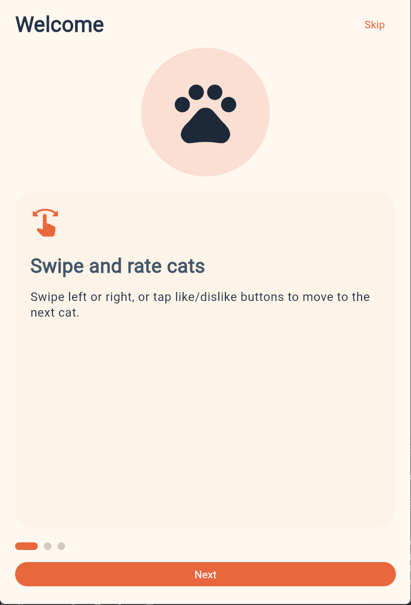
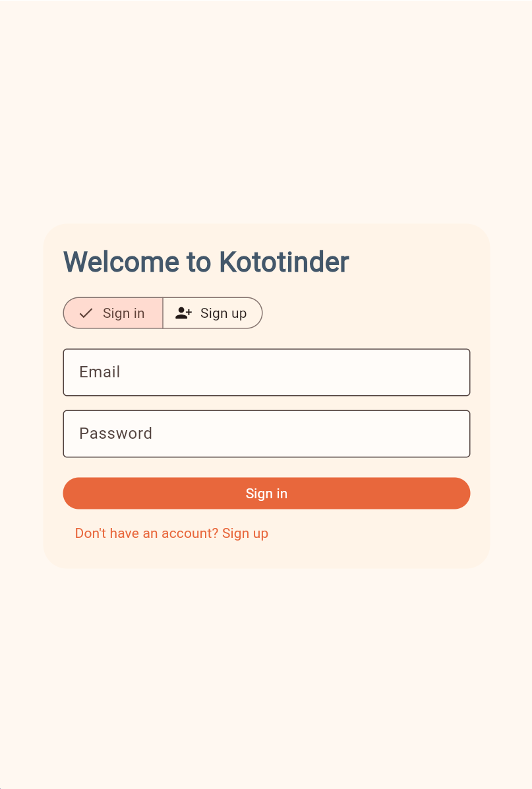
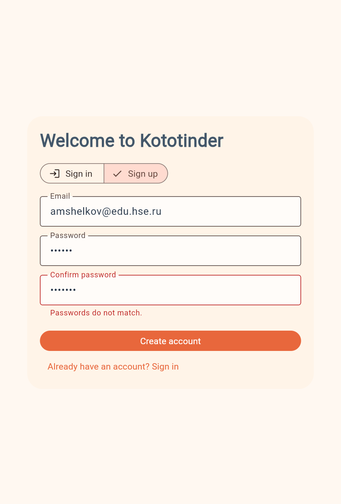
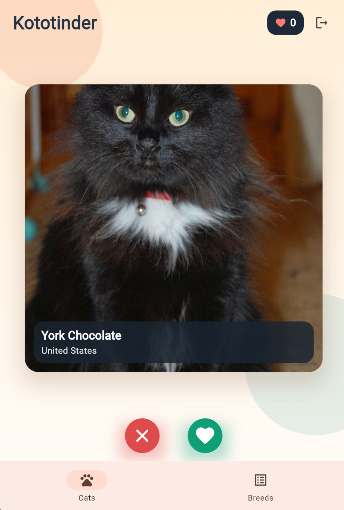
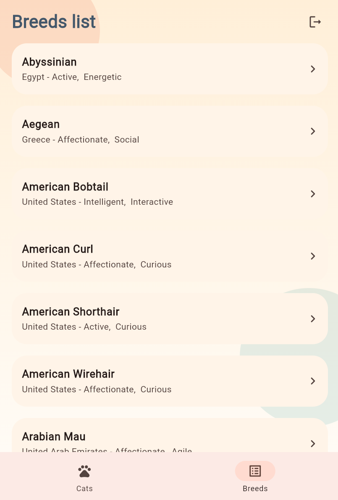
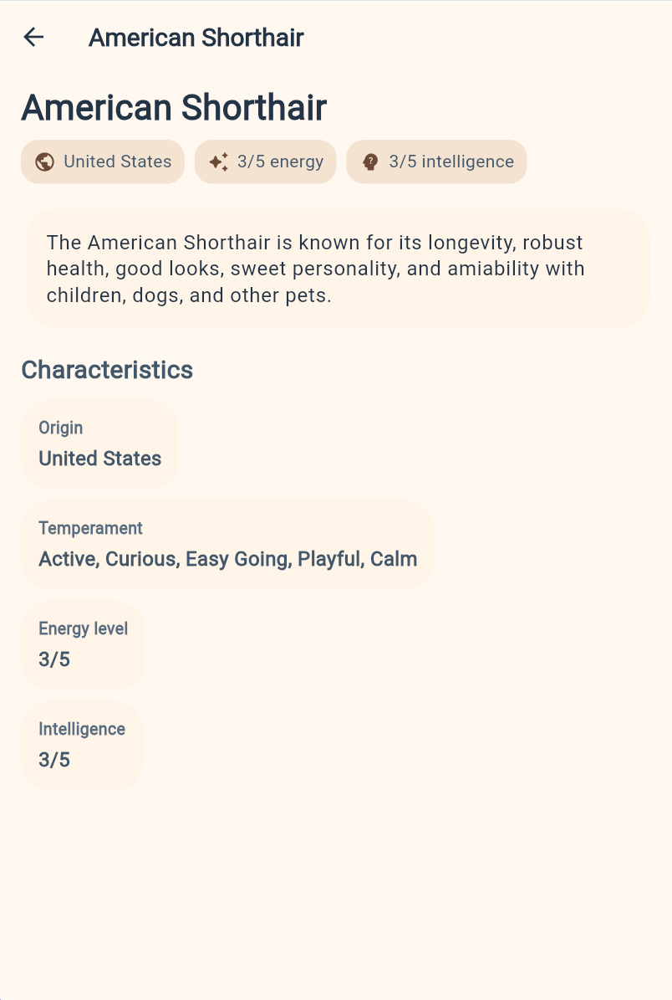
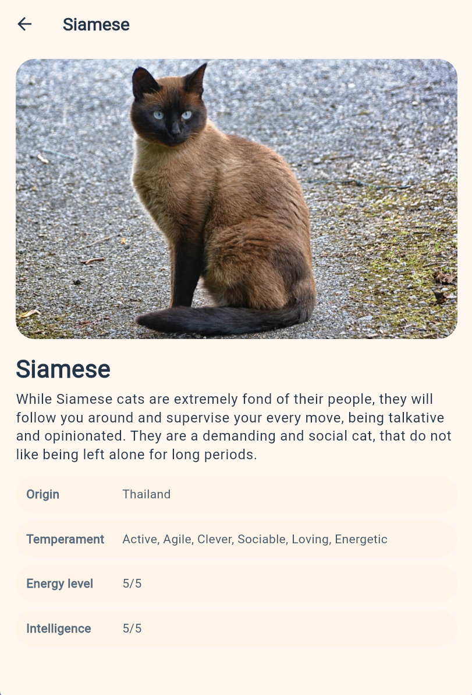

# Kototinder

### **ФИО:** *Шелков Андрей Михайлович*  
### **Группа:** *БПИ233*  

---

## Описание проекта

Kototinder — мобильное Flutter-приложение для просмотра случайных котиков и информации о породах.

Пользователь может листать карточки котов, ставить лайки, а также изучать различные породы и их характеристики.  
Данные загружаются из **TheCatAPI**, при недоступности API используется **локальный fallback**.

В версии **ДЗ-2** добавлены onboarding, регистрация/вход и рефакторинг архитектуры.
---

## Реализованный функционал

### Основной функционал

- Просмотр случайных котиков в формате карточек  
- Механика свайпов (лайк / дизлайк)  
- Подсчёт количества лайков  
- Открытие подробной информации о коте  
- Экран списка пород  
- Экран подробной информации о породе  
- Fallback на локальные данные при недоступности API  

### Onboarding

- Показывается при первом запуске приложения  
- Горизонтальный pager с несколькими шагами  
- Анимации при перелистывании экранов  
- Объясняет основные возможности приложения  

### Регистрация и вход

- Экран **Sign in / Sign up**  
- Валидация email и пароля  
- Локальное хранение данных через **Flutter Secure Storage**  
- Состояние авторизации сохраняется между перезапусками приложения  
## Тестирование

Добавлены автоматические тесты.

### Unit-тесты

- Проверка валидации email  
- Проверка валидации пароля  
- Проверка подтверждения пароля  

### Widget-тесты

- Ошибка при невалидном вводе  
- Успешный сценарий авторизации  

Тесты запускаются командой:

```
flutter test
```

---

## CI/CD

Настроен **GitHub Actions pipeline**, который автоматически запускается при `push` и `pull request`.

Pipeline выполняет:

- `flutter analyze`
- запуск unit-тестов
- запуск widget-тестов

При наличии ошибок pipeline падает.

---

## Скриншоты интерфейса

### Onboarding

<p align="center">
  
</p>

### Авторизация

<p align="center">
  
  
  
</p>

### Основной экран

<p align="center">
  
  
</p>

### Экран пород

<p align="center">
  
  
</p>

### Подробная информация кота
<p align="center">
  
</p>

## APK

[Скачать APK](https://github.com/13each/kototinder/releases/tag/v2.0.0)

